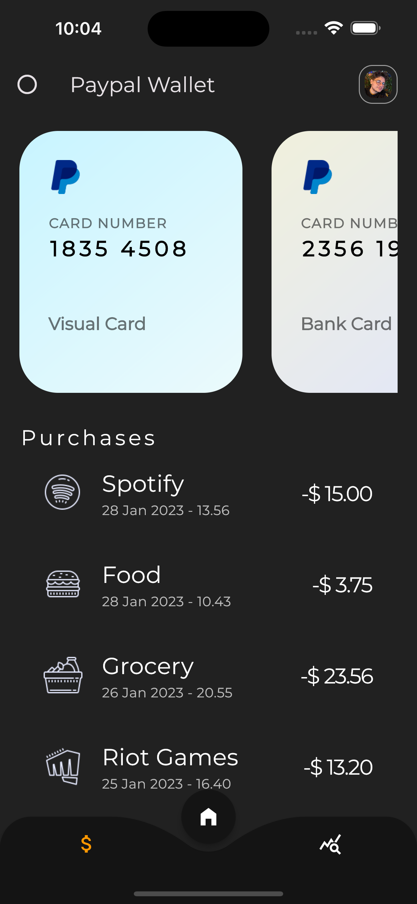
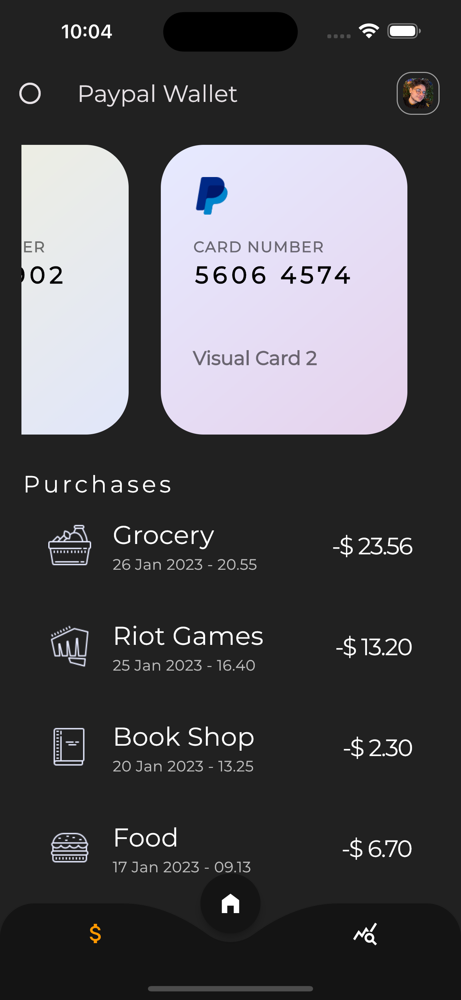
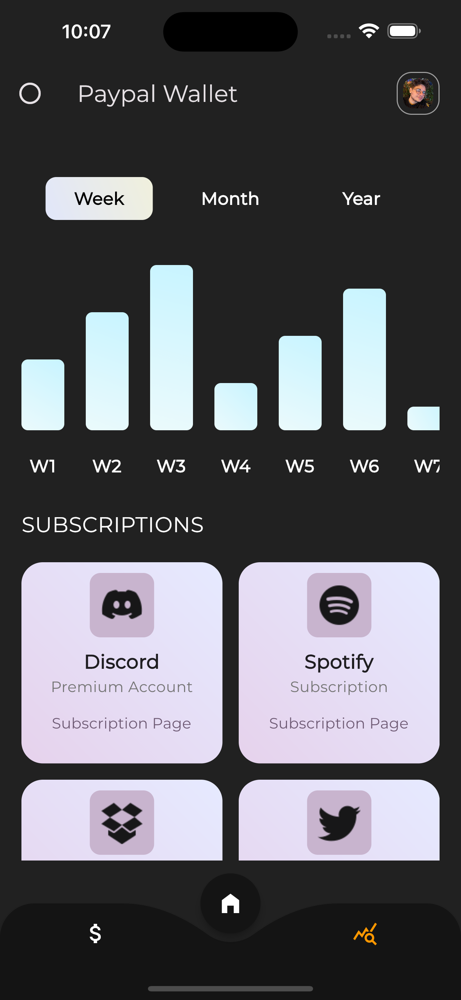
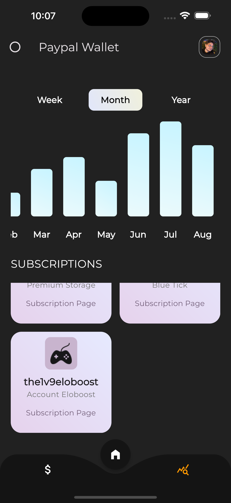
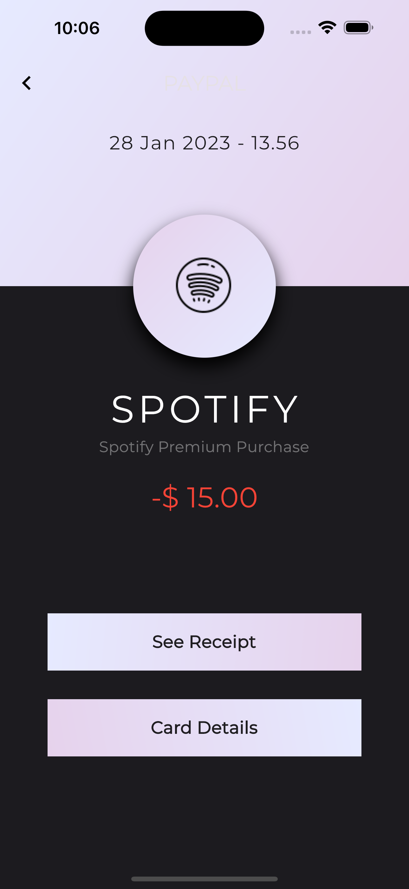
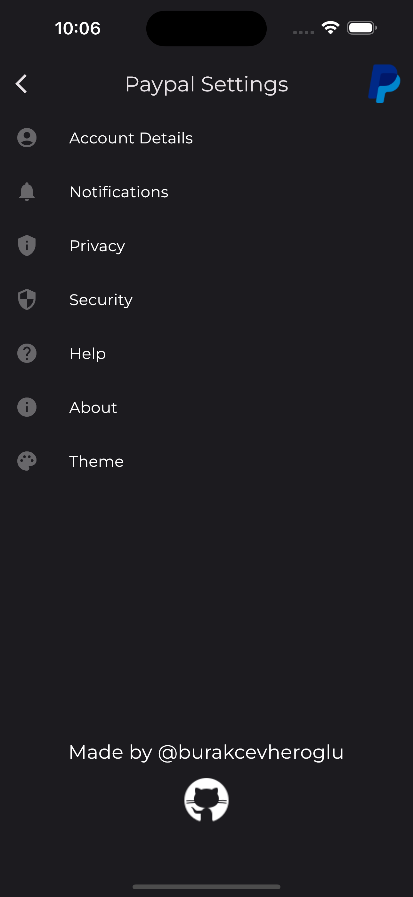

# PayPal Application as Redesigned

I redesigned UI/UX for PayPal and coded it with using Flutter.

## Screenshots
### Main Screen

| First Screen       |  First Screen          |
| ------------- |:-------------:|
|      |  |

### Statistics Screen

| Second Screen       |  Second Screen          |
| ------------- |:-------------:|
|      |  |

### Other Screens

| Purchase Detail Screen       |  Settings Screen          |
| ------------- |:-------------:|
|      |  |
